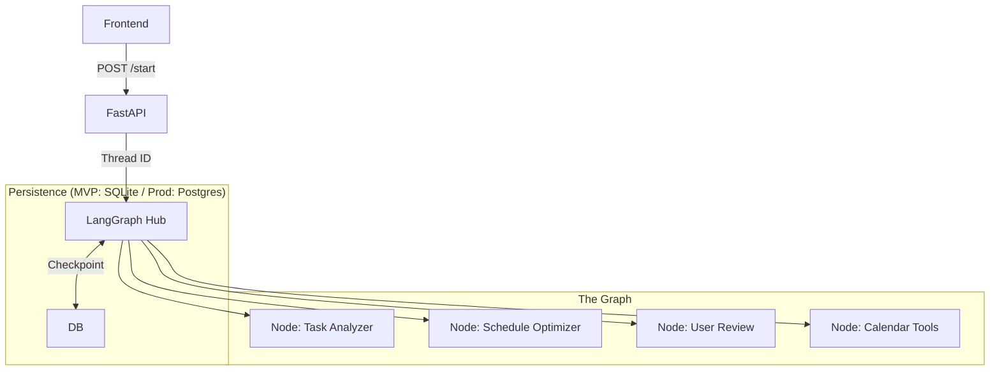

# AI Solutions Architecture & Implementation Guide

## 1. Executive Summary

This document serves as the **Single Source of Truth** for the AI Planner's backend architecture. It combines high-level architectural patterns with low-level implementation details, defining the roadmap from **MVP (Minimum Viable Product)** to **Production Scale**.

The core requirement is a **Human-in-the-Loop (HITL)** workflow that is robust against server restarts and API latency.

## 2. Architecture Overview: Hub-and-Spoke

We utilize a **LangGraph-orchestrated** architecture where a central state machine manages flow between specialized nodes and human interrupts.



---

## 3. MVP vs. Post-MVP Strategy

To ensure realistic development goals, we define clear boundaries. **Ollama (Local LLM)** is prioritizing for local development to ensure privacy and zero-cost testing.

| Feature Area | **MVP (Immediate Goal)** | **Post-MVP (Future Scale)** |
| :--- | :--- | :--- |
| **Orchestrator** | **LangGraph** (Local/In-Memory). | **LangGraph Cloud** or Distributed Workers. |
| **Logic (LLM)** | **Ollama** (Llama 3 / Mistral) running locally. | **Hybrid**: Local for small tasks, OpenAI/Claude for complex reasoning. |
| **Persistence** | **SQLite** (`AsyncSqliteSaver`). Simple JSON serialization of state. | **PostgreSQL/Redis**. Binary serialization, extensive history logging. |
| **Calendar** | **Google Calendar** (OAuth). Direct API calls via helper class. | **Unified API** (MS Graph + Google). Webhooks for real-time updates. |
| **Frontend API** | **Polling** (`GET /status`). Client polls every 2s. | **WebSockets / SSE**. Push notifications for status updates. |
| **Context** | **Short-term**. Only current task & calendar week. | **Vector DB (Chroma)**. Long-term memory of user habits. |

---

## 4. Detailed Implementation Specifications

### 4.1 Orchestrator State (Pydantic)
Refactoring `TypedDict` to `Pydantic` models is critical for validation.

```python
class PlanOption(BaseModel):
    id: str = Field(default_factory=lambda: str(uuid.uuid4()))
    start_time: datetime
    end_time: datetime
    reasoning: str
    score: int  # 0-100 preference match

class WorkflowState(BaseModel):
    # Inputs
    user_id: str
    task_input: str
    
    # Working Memory
    analysis: Optional[TaskAnalysis] = None
    calendar_events: List[Event] = []
    generated_options: List[PlanOption] = []
    
    # Control Flags
    error_message: Optional[str] = None
    retry_count: int = 0
```

### 4.2 Tooling Layer (MCP Style)
Tools must be defined as **Standalone Functions** with Pydantic arguments to ensure they can be used by Agents OR directly by API services.

**Required Tools for MVP**:
1.  `fetch_calendar_events(start: datetime, end: datetime) -> List[Event]`
    *   *Implementation*: Wraps `services.calendar_sync.google`.
2.  `check_availability(slot_start: datetime, duration_min: int) -> bool`
    *   *Implementation*: Helper logic.
3.  `commit_event(event: EventInput) -> Event`
    *   *Implementation*: Final write action.

### 4.3 Node Logic

#### **Node 1: Analyzer**
*   **Role**: structured extraction.
*   **Model**: **Ollama (Llama 3:8b / Mistral)**
*   **Config**: `ChatOllama(model="llama3", temperature=0)`
*   **Prompt**: "Extract tasks. Return ONLY valid JSON." (Must be strict for smaller models).
*   **Output**: JSON Schema matching `TaskAnalysis` model.

#### **Node 2: Scheduler (The Brain)**
*   **Role**: Constraint satisfaction.
*   **Model**: **Ollama (Llama 3:8b)** or **GPT-4o** (Optional fallback).
*   **Process**:
    1.  Call `fetch_calendar_events`.
    2.  Use CoT (Chain of Thought) to find slots.
    3.  Output 3 distinct `PlanOption` objects.

#### **Node 3: Human Interrupt (The Checkpoint)**
*   **Logic**: logic relies on `interrupt_before=["execute"]`.
*   **API Behavior**: The workflow *suspends* here. The serialized state is saved to SQLite.

---

## 5. API Contracts (The Interface)

### 5.1 Asynchronous Execution
Since LLMs can take 10s-60s, we **cannot** block the HTTP request.

1.  **Start**: `POST /api/v1/ai/start` -> returns `{ "thread_id": "123" }`
2.  **Poll**: `GET /api/v1/ai/{thread_id}` -> returns `{ "status": "human_review_needed", "options": [...] }`
3.  **Resume**: `POST /api/v1/ai/{thread_id}/resume` -> Body: `{ "selected_option_id": "opt_1" }`

---

## 6. Development Phasing

### Phase 1: The "Mock" Skeleton (Completed)
*   ✅ Basic LangGraph setup.
*   ✅ Mock LLM & Calendar.
*   ✅ Synchronous endpoints (Needs refactor).

### Phase 2: Persistence & Async (Next Priority)
*   [ ] **Action**: Switch LangGraph to use `AsyncSqliteSaver`.
*   [ ] **Action**: Refactor API to be Thread-ID based (Async).
*   [ ] **Action**: Update `state.py` to use Pydantic.

### Phase 3: Intelligence Injection (Ollama Integration)
*   [ ] **Action**: Install Ollama locally (`ollama pull llama3`).
*   [ ] **Action**: Replace `MockLLM` with `ChatOllama` from `langchain_community`.
    ```python
    from langchain_community.chat_models import ChatOllama
    llm = ChatOllama(model="llama3", base_url="http://localhost:11434")
    ```
*   [ ] **Action**: Connect `GoogleCalendarService` to the Graph Tools.

### Phase 4: Production Harden
*   [ ] **Action**: Redis for caching calendar reads.
*   [ ] **Action**: Dockerize.

---

## 7. Configuration & Secrets
Required in `.env`:
```env
# AI Models
OLLAMA_BASE_URL=http://localhost:11434
OPENAI_API_KEY=sk-... (Optional for production)

# Google Integrations
GOOGLE_CLIENT_ID=...
GOOGLE_CLIENT_SECRET=...

# Backend
DATABASE_URL=sqlite+aiosqlite:///./app.db
# Post-MVP:
# REDIS_URL=redis://...
```

## 8. Local Model Requirements
For developers working on this project:
1.  **Install Ollama**: [https://ollama.com/](https://ollama.com/)
2.  **Pull Model**: Run `ollama pull llama3` (approx 4GB).
3.  **Verify**: Ensure server runs on port 11434.
