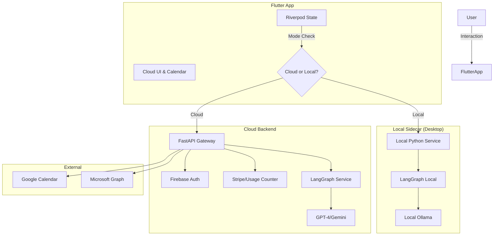

# AI Planner MVP - System Architecture (v1.1)

## Overview
A cross-platform (Flutter) AI scheduler with a "Cloud Gamification" theme. Features a "Hybrid" AI engine supporting both Cloud (FastAPI + LangGraph) and Local (Ollama) execution models.

## Gamification & UI Architecture
*   **Theme**: "Pixelated Cloud" (Baby Blue / White).
*   **Visual States**:
    1.  **Clear Skies**: Local Task Count < 5 AND No Overdue.
    2.  **Accumulating**: Task Count 5-10.
    3.  **Thunderstorm**: Task Count > 10 OR Overdue > 2.
    4.  **Rain**: Tasks Completed (Transition animation).
*   **State Management**:
    *   `GamificationProvider` (Riverpod) observes `TaskRepository`.
    *   Computes `CloudState` derived from task metrics.
    *   Drives `CustomPainter` or `LottieBuilder` widgets.

## Hybrid AI Architecture
The system supports two modes of operation driven by the `Pricing Tier` and User Preference.

### 1. Cloud Mode (Default/Mobile)
*   **LLM Provider**: OpenAI / Gemini (via Backend Proxy).
*   **Flow**: Frontend -> API -> LangGraph -> LLM API.
*   **Pros**: Zero setup, Syncs across devices.
*   **Cons**: Rate limits (Free Tier: 10/month), Data leaves device.

### 2. Local Mode (Desktop Only)
*   **LLM Provider**: Ollama (running locally on localhost:11434).
*   **Flow**: 
    1.  Frontend checks `Settings.useLocalAI`.
    2.  If/Then Branch:
        *   **Option A (Fat Client)**: Flutter calls `localhost:11434` directly. logic resides in Dart. (Harder to maintain logic parity).
        *   **Option B (Sidecar - CHOSEN)**: Desktop App bundles a lightweight Python executable (using PyInstaller) that runs the SAME LangGraph logic locally.
*   **Pros**: unlimited usage, Privacy.
*   **Cons**: High RAM usage, Desktop only.

## Component Diagram (Updated)

## Scalability Considerations
*   **Queueing**: Redis Cluster for Cloud AI jobs.
*   **Database**: PostgreSQL with Read Replicas.
*   **Assets**: Cloud assets stored on CDN (Cloudflare).

## Security
*   **Integrations**: Refresh tokens encrypted at rest (AES-256).
*   **Local**: Local Sidecar binds only to `127.0.0.1`.
*   **GDPR**: "Nuke" endpoints to scrub DB + Vector Store.
